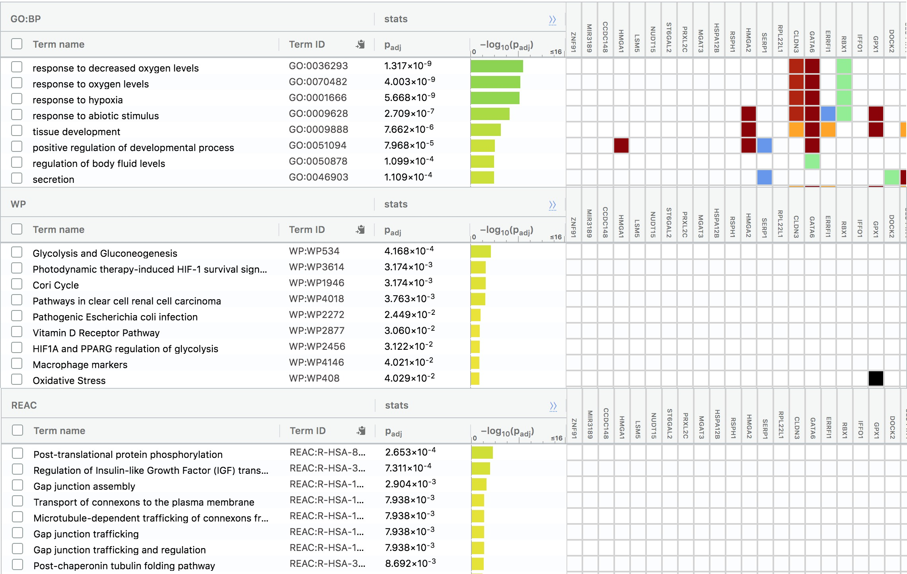
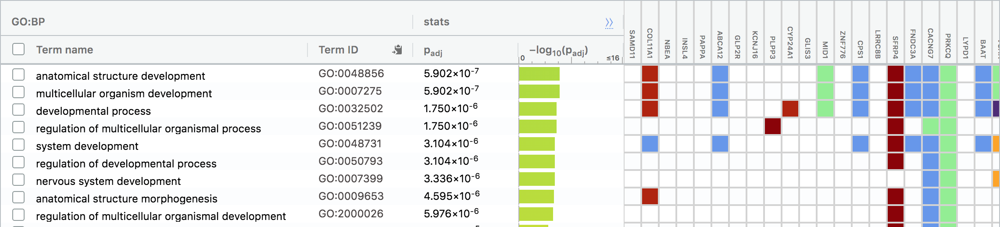

# This R Notebook will provide insight on ranks based on differential gene expression analysis and using over-represented analysis to determine the dominant themes. 
# Resources: Lecture Slides (lectures 5, 6) posted by Prof Ruth. 

```{r setup, include=FALSE}
knitr::opts_chunk$set(echo = TRUE)
```

# Introduction: Here is a short summary of the results from A1
Resource: Downloaded data set from GEO NCBI site
Data set: GSE136864
Supplementary File: GSE136864_elf1_counts_matrix.txt.gz

Experiment: This particular dataset studies the transcription factor ELF1, and it's effect in inbihiting replication of viral infections (like influenza), independent of type I interferons on A549 cells.

Definition: Interferons
- Usually when a virus enters the body, proteins called interferons are released which inhibit replication of the virus. However it was discovered that through this experiment the ELF1 transcriptional program is distinct from interferons and provides an additional layer to the immune system's response.

In this experiment, the growth of viral infections and host responses were studied in the presence of the ELF1 gene. A549 cells (found in human lung tissue) that were used were either:
- not transduced, or 
- transduced with the empty vector
- transduced with ELF1-WT
- transduced with ELF1-R8A mutant
- Indicated cultures were also stimulated under interferon beta for 6hrs and 48 hrs. 
* Note: The samples for ELF1-R8A mutant had 2 replicates, everything had 3.

Total Samples Collected: 17

Before filtering the data set: 63678 rows

Duplicates were removed on the basis of low counts. Based on edgeR recommendations, I kept the minumum count as 2, since we have a test sample type with only 2 replicates.

After Cleaning: 14935 rows

Normalization method: Used TTM. Since my data includes a lot of outliers in both extremes, TTM will allow me to remove the upper and lower percentages and false positives. After the normalization I had outliers in each of the 17 samples, but I chose to keep them due to the nature of RNA-seq data having dynamic ranges.

Now onto the core of A2 ...
# Differential Gene Expression

# 0 - Load and install the necessary libraries
```{r}
packages = c("kableExtra", "ComplexHeatmap", "circlize")
bioconductor_packages = c("BiocManager", "Biobase", "ComplexHeatmap", "limma", "edgeR")

for (package in packages){
   install.packages(package)
}

for(package in bioconductor_packages){
  BiocManager::install(package, update = FALSE)
}

# Load the libraries
library(kableExtra)
library(limma)
library(ComplexHeatmap)
library(edgeR)
library(Biobase)
```

*1 - Initial setup*
Load our clean, normalized data and view it.
```{r}
normalized_count_data <- read.csv("counts_filtered.csv")
dim(normalized_count_data)  # returns [1] 14935    19
kable(normalized_count_data[1:10,1:19], type="html")

```

Here is a snippet of our finalized, filtered, normalized data from A1. We are left with a dataset with the Ensembl gene IDs and their associated HGNC symbols (although some IDs do not contain HGNC symbols, they are shown as 'NA' in the table, as they have not been mapped to one yet). Here are the names of the 17 different samples that were retrieved:
```{r}
cols <- normalized_count_data[,3:19]
colnames(cols)
```

We have 6 different groups(samples) to compare, but that may be too many at once. Since this experiment wants to prove there is an additional effect of ELF1 genes outside of interferons, let us choose the following 4 samples: empty_IFN48, empty_IFN6, ELF1_mock, R8A_mock
empty_IFN48 & empty_IFN6 are the interferon samples
ELF1_mock & R8A_mock are the ELF1 samples
```{r}
chosen_samples <- normalized_count_data[,3:19]
chosen_samples <- chosen_samples[, c(4, 5, 6, 16, 17, 7, 8, 9, 10, 11, 12)]
chosen_samples
```

*Groups re-defined*
```{r}
samples <- data.frame(lapply(colnames(chosen_samples)[1:11],
                             FUN = function(x) {
                               unlist(strsplit(x, split="_"))[c(1, 3, 2)]
                             }))
colnames(samples) <- colnames(chosen_samples)[1:11]
rownames(samples) <- c("Treatment", "trial_num", "mock_or_IFN")
samples <- data.frame(t(samples))
samples$Test_run = paste(samples$Treatment,samples$mock_or_IFN, sep = "_")
samples
```

*Create a Heat Map*
```{r}
library(ComplexHeatmap)
library(circlize)

heatmap_matrix <- normalized_count_data[,3:ncol(normalized_count_data)]
rownames(heatmap_matrix) <- normalized_count_data$ensembl_gene_id
colnames(heatmap_matrix) <- colnames(normalized_count_data[,3:ncol(normalized_count_data)])

if(min(heatmap_matrix) == 0){
    heatmap_col = colorRamp2(c( 0, max(heatmap_matrix)), c( "white", "red"))
  } else {
    heatmap_col = colorRamp2(c(min(heatmap_matrix), 0, max(heatmap_matrix)), c("blue", "white", "red"))
  }
current_heatmap <- Heatmap(as.matrix(heatmap_matrix),
                               show_row_dend = TRUE,
                               show_column_dend = TRUE, 
                               col=heatmap_col,
                               show_column_names = TRUE, 
                               show_row_names = FALSE,
                               show_heatmap_legend = TRUE
                               )
current_heatmap
```


*Create MDS Plot*
I was unable to create an MDS plot on the desirable sample groups in A1, so here's one now!
```{r}
filtered_data_matrix <- as.matrix(chosen_samples)

rownames(filtered_data_matrix) <- normalized_count_data$ensembl_gene_id
#filtered_data_matrix
d = DGEList(counts=filtered_data_matrix, group=samples$Test_run)

limma::plotMDS(d, col = c("darkgreen","blue", "cyan", "green")[factor(samples$Test_run)], 
               main = "ELF1 vs Interferons Sample groups after TMM normalization")
```
The dissimilarity shown between the 2 groups with ELF1 gene and with interferons is clear. Using the above MDS plot, and chosen 4 sample groups of interest, we can create our model. 

*2 - Define model design and factors*

```{r}

sample_groups <- samples[, c(2, 4)]
sample_groups

model_design <- model.matrix(~ sample_groups$trial_num)
kable(model_design, type="html")

expressionMatrix <- as.matrix(chosen_samples)
rownames(expressionMatrix) <- normalized_count_data$ensembl_gene_id
colnames(expressionMatrix) <- colnames(chosen_samples)
minimalSet <- ExpressionSet(assayData=expressionMatrix)

dim(minimalSet)

#Fit our data to the above model
fit <- lmFit(minimalSet, model_design)

# Referred to lecture 5 slides, slides 4-6
```

```{r}
fit2 <- eBayes(fit,trend=TRUE)

topfit <- topTable(fit2, 
                   coef=ncol(model_design),
                   adjust.method = "BH",
                   number = nrow(expressionMatrix))
#merge hgnc names to topfit table
output_hits <- merge(normalized_count_data[,1:2],
                     topfit,
                     by.y=0,by.x=1,
                     all.y=TRUE)

#sort by pvalue
output_hits <- output_hits[order(output_hits$P.Value),]

kable(output_hits[1:10,],type="html")
# Referred to lecture 5 slides, slides 21-23

```

I chose to keep the significance threshold as the default 0.05, and from this the number of genes that did not pass the threshold are:
```{r}
# genes that pass the threshold
length(which(output_hits$P.Value < 0.05))   # returns 108

# genes that pass adjusted p value
length(which(output_hits$adj.P.Val < 0.05))   # returns 0
```

Notice that the adjusted p-values are correct. This simply means there is no evidence at all for rejecting the null hypothesis. This is not very promising as the 108 genes that were significantly expressed before the adjustment all dissapeared, and after adjustment of the p-value we have none. 
Let us try multiple hypothesis testing to see if we can get better adjusted p values. 

*3 - Multiple Hypothesis Testing*
Create a different linear model that includes 2 parameters, trial number and trial type
```{r}
d = DGEList(counts=filtered_data_matrix, group=sample_groups$trial_num)
model_design_two_params <- model.matrix(
  ~ sample_groups$Test_run + sample_groups$trial_num)
kable(model_design_two_params,type="html")
```

```{r}
fit_params <- lmFit(minimalSet, model_design_two_params)
fit2_params <- eBayes(fit_params,trend=TRUE)

topfit_params <- topTable(fit2_params, 
                   coef=ncol(model_design_two_params),
                   adjust.method = "BH",
                   number = nrow(expressionMatrix))
#merge hgnc names to topfit table
output_hits_params <- merge(normalized_count_data[,1:2],
                         topfit_params,by.y=0,by.x=1,all.y=TRUE)
#sort by pvalue
output_hits_params <- output_hits_params[order(output_hits_params$P.Value),]

kable(output_hits_params[1:10,],type="html")
```

```{r}
# genes that pass the threshold
length(which(output_hits_params$P.Value < 0.05))

# genes that pass adjusted p value
length(which(output_hits_params$adj.P.Val < 0.05))
```

```{r}
s <- sample_groups$Test_run
s
```


```{r}

d = DGEList(counts=filtered_data_matrix, group=sample_groups$Test_run)
model_design_pat <- model.matrix(
  ~ sample_groups$trial_num + sample_groups$Test_run)

#estimate dispersion
d <- estimateDisp(d, model_design_pat)
#calculate normalization factors
d <- calcNormFactors(d)
#fit model
fit <- glmQLFit(d, model_design_pat)

#calculate differential expression
model_design_pat
qlf.pos_vs_neg <- glmQLFTest(fit, coef='sample_groups$trial_num2')
```

```{r}
#Get all the results
qlf_output_hits <- topTags(qlf.pos_vs_neg,sort.by = "PValue",
                           n = nrow(filtered_data_matrix))
length(which(qlf_output_hits$table$PValue < 0.05))
length(which(qlf_output_hits$table$FDR < 0.05))
```
```{r}
kable(topTags(qlf.pos_vs_neg), type="html")
```

```{r}
# Find out the number of upregulated 
length(which(qlf_output_hits$table$PValue < 0.05 
             & qlf_output_hits$table$logFC > 0))
# and downregulated genes
length(which(qlf_output_hits$table$PValue < 0.05 
             & qlf_output_hits$table$logFC < 0))
```


```{r}
# Referred to lecture slides for this portion
#merge gene names with the top hits and collect the down regulated and upregulated genes
qlf_output_hits_withgn <- merge(normalized_count_data[,1:2],qlf_output_hits, by.x=1, by.y = 0)
qlf_output_hits_withgn[,"rank"] <- -log(qlf_output_hits_withgn$PValue,base =10) * sign(qlf_output_hits_withgn$logFC)
qlf_output_hits_withgn <- qlf_output_hits_withgn[order(qlf_output_hits_withgn$rank),]
upregulated_genes <- qlf_output_hits_withgn$hgnc_symbol[
  which(qlf_output_hits_withgn$PValue < 0.05 
             & qlf_output_hits_withgn$logFC > 0)]
downregulated_genes <- qlf_output_hits_withgn$hgnc_symbol[
  which(qlf_output_hits_withgn$PValue < 0.05 
             & qlf_output_hits_withgn$logFC < 0)]
all_genes <- c(upregulated_genes, downregulated_genes)
write.table(x=upregulated_genes,
            file=file.path("data","upregulated_genes.txt"),sep = "\t",
            row.names = FALSE,col.names = FALSE,quote = FALSE)
write.table(x=downregulated_genes,
            file=file.path("data","downregulated_genes.txt"),sep = "\t",
            row.names = FALSE,col.names = FALSE,quote = FALSE)
write.table(x=all_genes,
            file=file.path("data","all_genes.txt"),sep = "\t",
            row.names = FALSE,col.names = FALSE,quote = FALSE)

```

*Threshold Analysis with Gprofiler*
We now have the thresholded list of downregulated and upregulated genes. Now we can perform our threshold analysis. 

Similar to the homework assignment, I have chosen to use the Benjamini-Hochberg FDR, WikiPathways, Reactome and GO biological process from the gprofiler site, and will copy paste the individual down regulated and upregulated genes I came up with. 

*Here are the Gprofiler results for the files uploaded:*
# Upregulated Genes:
GO Biological - 318 genesets
Reactome - 32 genesets
WikiPathways - 10 genesets

# Downregulated Genes:
GO Biological - 251 genesets
Reactome - 0 genesets
WikiPathways - 0 genesets

We were not able to produce any genesets from Reactome or WikiPathways for downregulated genes.

Here are the images taken from the detailed query tab for upregulated and downregulated genes, respectively. 





# Resources
http://www.endmemo.com/program/R/readtable.php
https://cran.r-project.org/web/packages/kableExtra/vignettes/awesome_table_in_html.html


