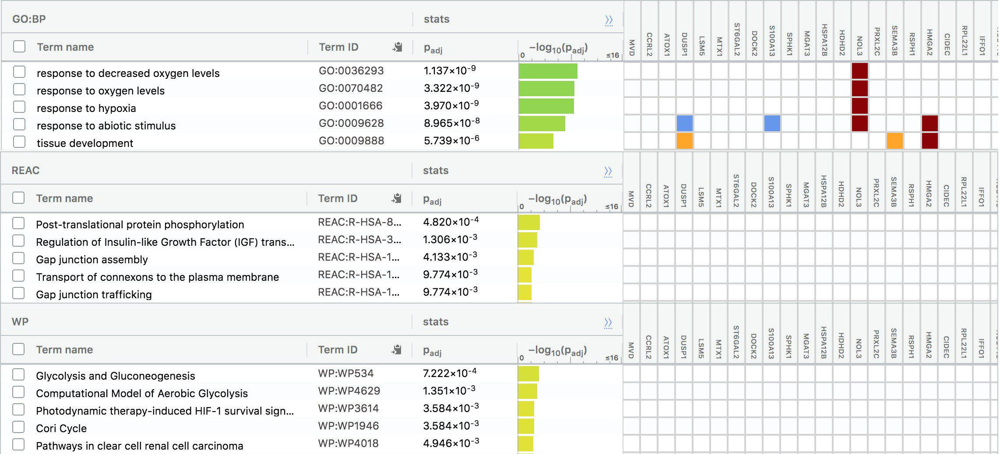
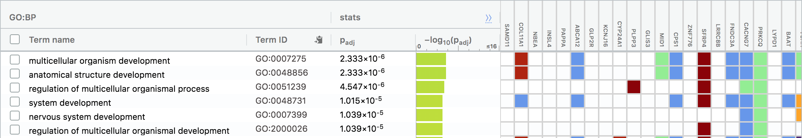
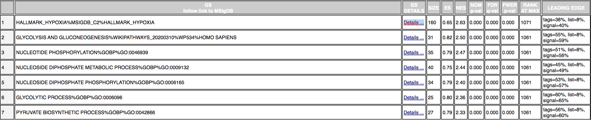

---
title: "Assignment 3: DataSet Pathway & Network Analysis"
author: "Priyanka Narasimhan"
output: 
  html_document:
    df_print: paged
    toc: true
    toc_depth: 2
--- 

## Summaries of previous assignments {.tabset .tabset-fade}

```{r setup3, include=FALSE}
knitr::opts_chunk$set(echo = FALSE, warning = FALSE, cache = TRUE, fig.asp = 1)

library(knitr)
```

### Assignment 1 

```{r intro_a1, child = 'a1_child.Rmd'}
```
<br /><br />

### Assignment 2 
<br />(I had to redo some parts of A2 since it was not fully completed)
```{r intro_a2, child = 'a2_child.Rmd'}
```

## Assignment 3 
(Now onto A3 ...)

#### Non-thresholded Gene set Enrichment Analysis

We want to use GSEA to run a non-thresholded gene set enrichment analysis. We need 2 things: <br />
1) Ranked gene list from A2 <br />
2) Latest genesets from the baderlab geneset collection  <br />

Let us convert our enrichment scores from the last assignment and convert it to a rank file. 

```{r}
rank_data <- qlf_output_hits_withgn
rank_data <- rank_data[,c(2,8)]
write.table(rank_data,file="ranked_genes.rnk",quote=F,sep="\t",row.names=F)
head(rank_data)
```

```{r}
if (!require(RCurl)){
  install.packages("RCurl")
}
library(RCurl)
```


```{r download_gmt, message=FALSE}
gmt_url = "http://download.baderlab.org/EM_Genesets/current_release/Human/symbol/"
# list all the files on the server
filenames = getURL(gmt_url)
tc = textConnection(filenames)
contents = readLines(tc)
close(tc)
# get the gmt that has all the pathways and does not include terms inferred from
# electronic annotations(IEA) start with gmt file that has pathways only
rx = gregexpr("(?<=<a href=\")(.*.GOBP_AllPathways_no_GO_iea.*.)(.gmt)(?=\">)", contents, 
    perl = TRUE)
gmt_file = unlist(regmatches(contents, rx))
dest_gmt_file <- file.path(gmt_file)
download.file(paste(gmt_url, gmt_file, sep = ""), destfile = dest_gmt_file)
```

As part of A2, I was not able to conduct a thresholded enrichment analysis, but now using G:profiler, I was able to test the upregulated and downregulated genes: <br />

For upregulated genes the prominent values were: <br />

<br />
For downregulated genes the prominent values were: <br />


Our results from non-thresholded analysis, from GSEA gives us: <br />


The top results from GSEA tells us that the top hits include Hypoxia, glycolysis and gluconeogenesis, nucleotide phosphorylation.. and so on. <br />
Comparing this to the upregulated and downregulated genes, the top pathways are actually more consistent with the upregulated genes. In fact, although the entire results for upregulated genes are not shown, all the top 5 pathways from the non thresholded analysis are seen within the top few hits in upregulated genes. This shows that those genes are upregulated in the study. 
<br /> 
The downregulated genes are not as similar to the GSEA results. The downregulated genes are more 'system development' based (ie. multi cellular organism development, anatomical structure development, nervous sytem development...). These do not show up in the top 100 GSEA results. 


#### Visualize Gene set Enrichment Analysis in Cytoscape

#### Interpretation and detailed view of results

## External Resources
https://bookdown.org/yihui/rmarkdown/html-document.html#section-numbering <br />
https://yihui.org/knitr/demo/child/


